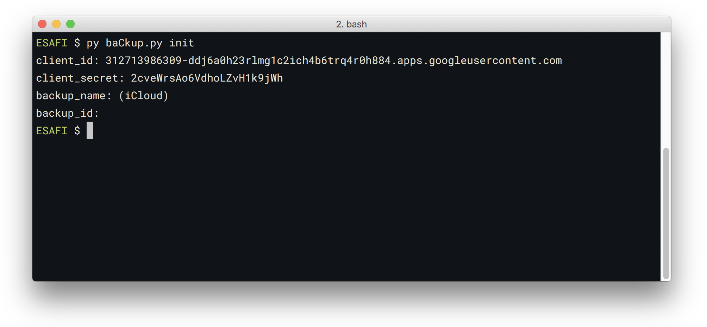
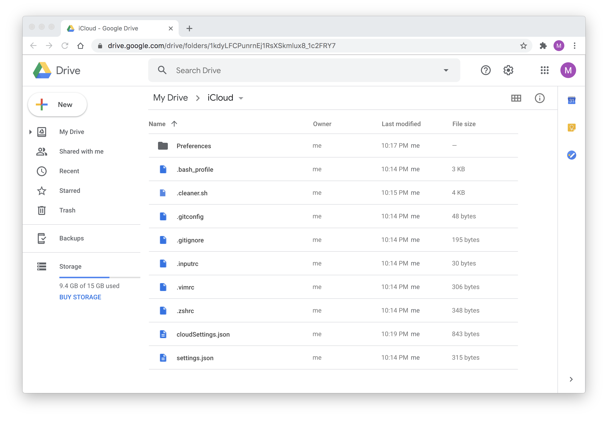

# baCkup

Python script to `upload / restore` `files & folders` `to / from` Google Drive

Synchronize your files over a **Google Drive**

This directory contains a script, ```drive.py```, for backing up your files

## Requirements

Run the following command to install the library using ```pip```:

```
$ pip install --upgrade google-api-python-client google-auth-httplib2 google-auth-oauthlib tqdm
```

## Configuring

### enable google drive api and get client_id and client_secret

1. For authorization you need to create a new Cloud Platform project and automatically enable the Drive API [here](https://console.developers.google.com/flows/enableapi?apiid=drive)

	━ if you have any troubles, check [Python Quickstart guide](https://developers.google.com/drive/v3/web/quickstart/python).

2. After creating the project, Click `Credentials` in the left-side panel, then `Create credentials`, then `OAuth client ID`.

3. From the Application type, select `Other` and click the button `Create`

4. It will display the popup with `client id` and `client secret`. Use these values to next step

### init

After preparing the get Client ID and Client Secret you now can start Initial setup with the following command

```
$ py drive.py init
```



Enter `client_id` and `client_secret`

You can set the `backup_id` or (`backup_name` assuming a first time) for baCkup. This is the directory that baCkup script considers to be the root of your drive.

So if the folder you want baCkup to use has a URL which looks like `https://drive.google.com/drive/folders/1XyfxxxxxxxxxxxxxxxxxxxxxxxxxKHCh` in the browser, then you use `1XyfxxxxxxxxxxxxxxxxxxxxxxxxxKHCh` as the `backup_id` in the config.

### Add support for any file or directory

In your home, create a ```~/.config.ini``` config file for the files and directories you'd like to sync.

add the paths to allow in the `[FILES_TO_SYNC]` section, one by line.

```ini
[FILES_TO_SYNC]
~/Library/Preferences
~/.bash_profile
~/.gitconfig
~/.gitignore
~/.inputrc
~/.vimrc
~/.zshrc
~/.cleaner.sh
~/Library/Application Support/Code/User/settings.json
```



Optional: put script that you need to cron or any other task planner that you use.

## Running

```
$ python drive.py --help
```

## Note

First time you run the script, your browser will open to approve permissions. It is only first time.
